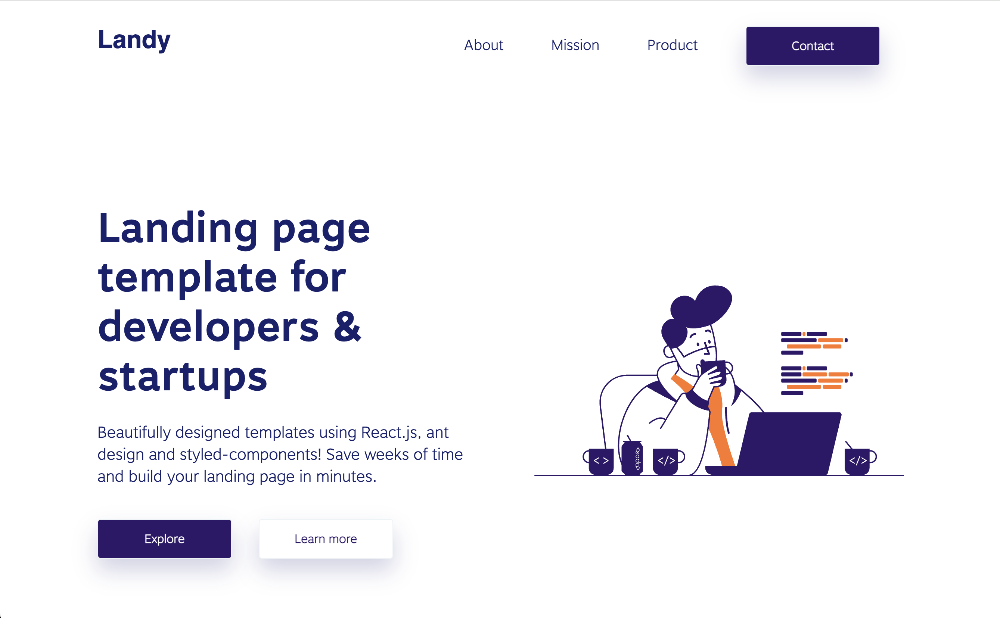

# Build your own landing page

## Goal
In this exercise you will customize your own landing page using the beautiful Landy template. Landy template is built on top of [Create React App](https://create-react-app.dev/).

## Exercise
1. [Change Colors](https://github.com/smolthing/landing-page-landy/commit/8dee3f7bb0b5fe8b7b7d3ea6715ee6d24bf1ba8a)
 - Replace hardcoded colors to reusable colors
2. [Adjust Transitions](https://github.com/smolthing/landing-page-landy/commit/adf430015e4110db7bd1881c62fd4853ae9dbc18)
 - Add custom transition from [react-awesome-reveal](https://react-awesome-reveal.morello.dev/) library
3. [Move Objects](https://github.com/smolthing/landing-page-landy/commit/859ec5c9bc6ec9cc8cf1ae2c6ce89440c311c19d)
 - Use increment of 5 in position and size for consistency and predictability.
4. [Change Hover States](https://github.com/smolthing/landing-page-landy/commit/6db799f8a4e08b5c53ea2b91fe678f5101dcea5f)
 - Use `cursor: pointer` to indicate clickable object
5. [Customize Shadows](https://github.com/smolthing/landing-page-landy/commit/d44142a3129bc1d96c769e4ffbf1c78c21b97ff4)
 - Use solid shadow with darken method from [polished](https://polished.js.org/docs/) library 

## Getting Started
### `before-landing` folder
This folder contains the initial template and all the necessary files that you will work on.

### `after-landing` folder
This folder contains the completed solution, which you can refer to if needed.

### Running the app
1. Go into `before-landing` folder and run the app. App runs on http://localhost:3000.
```
cd before-landing
npm start
```
2. Make the necessary changes as per the exercise tasks.
3. Compare your work with the files in the `after` folder if you need any guidance or reference.

## Demo
### Before

### After

by [smolthing](https://www.youtube.com/@smolthing)

## Contribute
Create a PR to add an image of your homework. Example PR.
